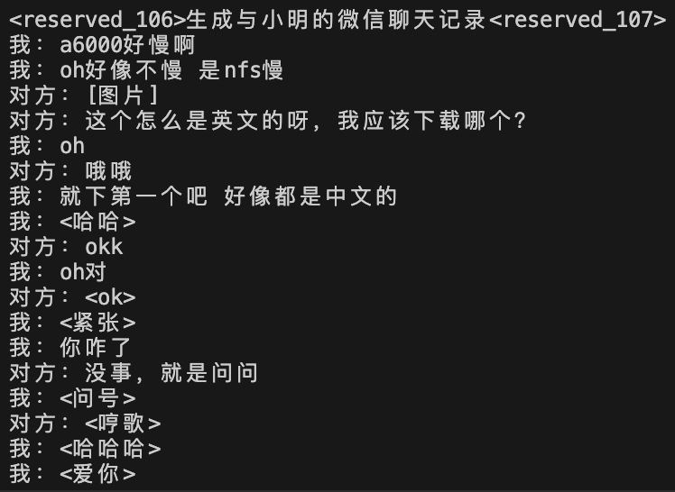

# WeChatPersona 🤖

Introducing WeChatPersona, virtual agents to replicate the conversational style of your real friends on WeChat. By leveraging the powerful Baichuan2-7B-Chat model and fine-tuning it with your WeChat history, WeChatPersona delivers personalized virtual agents that emulate the language patterns and style of your friends.

## Demo
Witness the capabilities of WeChatPersona in action with our demonstration (trained on 8 4090s for 10 hours):


Note: Pre-trained weights are not provided for privacy reasons


## Usage 🛠️
Unlock the full potential of WeChatPersona with these simple steps:
1. **Install Dependencies:** Begin by installing the necessary dependencies using pip:
```bash
pip install transformers deepspeed
```
2. **Prepare Training Data:** Export your [WeChatMsg](https://github.com/LC044/WeChatMsg) message history to a CSV file using WeChatMsg. Optionally, you can utilize `StoreEmotion.db` for additional emotion descriptions. Set configs in `prepare_data.py`. Then run
```bash
python src/prepare_data.py
```
3. **Run LoRA Finetuning:** Initiate the LoRA fine-tuning process with the provided script:
```bash
bash src/ft.sh
```
4. **Run the demo:** Inference using fine-tuned model:
```bash
python src/demo.py
```

## Acknowledgements

- [WeChatMsg](https://github.com/LC044/WeChatMsg)
- [Baichuan2-7B-Chat](https://huggingface.co/baichuan-inc/Baichuan2-7B-Chat)
